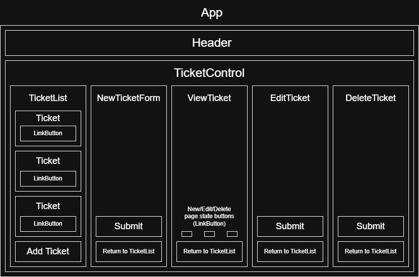

# Help Queue

#### _A help queue program._

#### By _**India Lyon-Myrick**_

## Technologies Used

* _Javascript_
* _HTML_
* _CSS_
* _Bootstrap_
* _Webpack_
* _Node.js_
* _React.js_
* _Git_

## Description

_A website where users in need of help can post to a queue. The website includes a list of tickets, the ability to add new tickets, and functionality to edit or delete existing tickets._

_Diagram of planned site:_

## Setup/Installation Requirements

* _You will need Node.js (`https://nodejs.org/en/download/current`) to run the program._

_1: Clone the repository to a folder of choice on your machine (by either using the "Code" button on the GitHub page, or in a terminal application using `git clone https://github.com/igl-myrick/help-queue`)._

_2: Using a terminal application such as Git Bash or Windows Command Prompt, navigate to the top level of the program folder and run `npm install`. This may take some time._

_3: Next, run `npm run build` to build the program._

_4: Once the program is built, run `npm run start` to open and use the program._

## Known Bugs

* _When attempting to return to a previous component, the app does not correctly switch back to the previous component._
* _Delete functionality currently does not work._

## License

_[MIT](/LICENSE.md)_